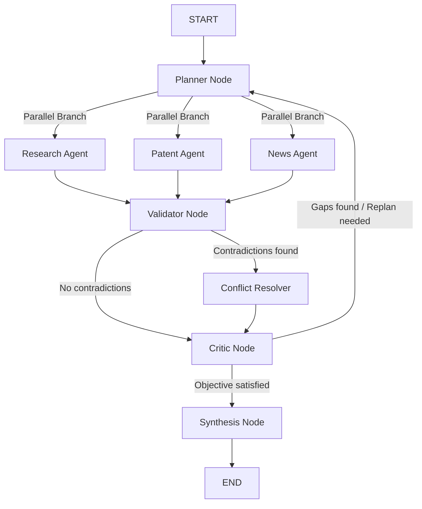

# RadarX Agentic Architecture: LangGraph Orchestration Justification

## Why LangGraph?

For RadarX to handle complex, open-ended research investigations, it requires a workflow that is cyclic, stateful, and highly resilient. A simple sequential chain (like a traditional LangChain sequence) is insufficient. RadarX uses **LangGraph** because it natively provides the following advanced agentic capabilities:

---

## Core Capabilities Used by RadarX

### 1. Stateful Graph Representation
Unlike linear pipelines, RadarX’s agent execution is mapped as a directed graph where nodes represent agent actions (Planning, Researching, Patent Auditing, News Scanning, Resolving Conflicts, Self-Evaluation, and Synthesizing) and edges represent execution flows. The state is shared across all nodes via a typed `InvestigationState`.

### 2. Parallel Execution (Fan-Out & Fan-In)
When the Planner node determines that multiple tasks are independent (e.g., Crossref Academic Research, USPTO Patent searches, and Google News scanning), LangGraph initiates parallel branching. These agents execute concurrently, reducing latency, and join back (fan-in) automatically at the Validator node.

### 3. Cyclic Workflows & Self-Evaluation
Investigations are rarely completed on the first attempt. The **Critic Node** performs self-evaluation before report compilation. If confidence is low or gaps remain, the critic routes execution back to the **Planner Node** (a cyclic edge) to dynamically replan and verify new hypotheses.

### 4. Checkpointing & Resilience
LangGraph checkpoints the state after each node execution. In RadarX, this is serialized and saved to MongoDB. If the server crashes or the process restarts, the orchestrator retrieves the latest checkpoint and resumes execution seamlessly.

### 5. Failure Recovery & Fallback
If a provider times out or fails:
- Retries run with exponential backoff.
- If retries fail, fallback providers are attempted (e.g., Patent Agent falls back to searching via the Web Intelligence provider).
- If no fallback is available, confidence is reduced, and the system continues rather than crashing.

### 6. Conflict Resolution Node
When multiple sources report contradictory claims, the graph routes to the Conflict Resolution node. It grades sources (Primary vs. Secondary) and checks dates (newer wins) to resolve the mismatch, logging any remaining uncertainty in the final report.

---

## Node Sequence Diagram

